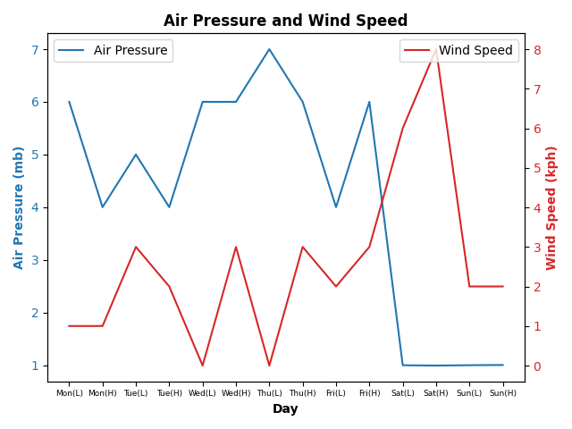
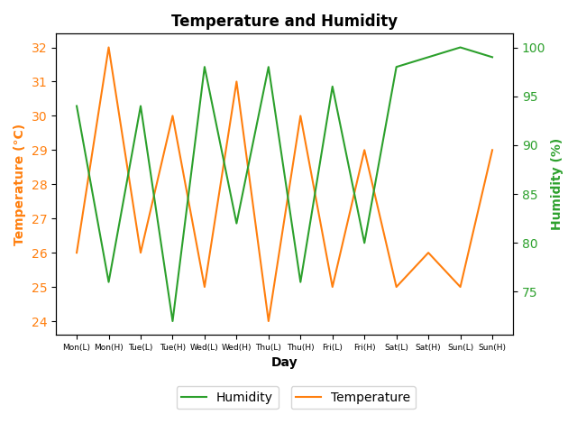
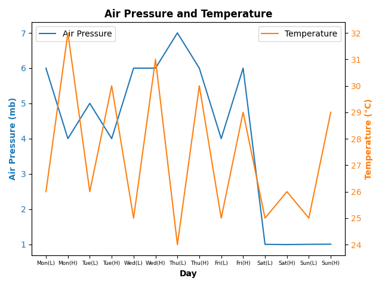
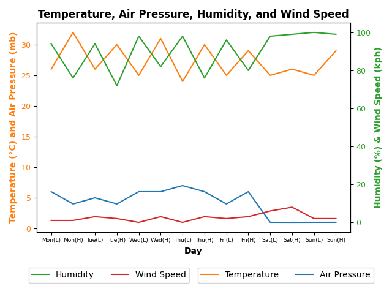

# Weather Data Analysis

This documentation outlines the graphing process for a BLA in Earth Science. This project presents a set of weather data collected over seven days, encompassing measurements of temperature, air pressure, humidity, wind speed, and wind direction, with each day containing high and low values. The last three days of the week experienced the passing of a typhoon, and this README file explains four graphs visualizing the data.

## Graphing Using Python

To create the graphs for this analysis, Python was utilized, specifically using libraries such as Matplotlib and Pandas. Below are the steps to graph the data:

1. **Install Required Libraries**:
   Ensure you have the necessary Python libraries installed. You can do this using pip:
   ```
   pip install matplotlib pandas
   ```

2. **Load the Data**:
   Use Pandas to load your weather data into a DataFrame. Here’s an example:
   ```
   import pandas as pd

   data = {
       'Day': ['Monday', 'Tuesday', 'Wednesday', 'Thursday', 'Friday', 'Saturday', 'Sunday'],
       'High_T': [32, 30, 31, 30, 29, 26, 29],
       'Low_T': [26, 26, 25, 24, 25, 25, 25],
       'Air_Pressure': [1004, 1004, 1006, 1006, 1004, 992, 1003],
       'Humidity': [76, 72, 82, 76, 80, 99, 99],
       'Wind_Speed': [1, 2, 3, 3, 3, 8, 2]
   }

   df = pd.DataFrame(data)
   ```

3. **Create the Graphs**:
   Use Matplotlib to plot the data. Below is an example for Graph 1:
   ```
   import matplotlib.pyplot as plt

   # Graph 1: Air Pressure and Wind Speed
   fig, ax1 = plt.subplots()

   ax1.set_xlabel('Day')
   ax1.set_ylabel('Air Pressure (mb)', color='tab:blue')
   ax1.plot(df['Day'], df['Air_Pressure'], color='tab:blue', label='Air Pressure')
   ax1.tick_params(axis='y', labelcolor='tab:blue')

   ax2 = ax1.twinx()  
   ax2.set_ylabel('Wind Speed (kph)', color='tab:red')  
   ax2.plot(df['Day'], df['Wind_Speed'], color='tab:red', label='Wind Speed')
   ax2.tick_params(axis='y', labelcolor='tab:red')

   plt.title('Graph 1: Air Pressure and Wind Speed')
   plt.show()
   ```

4. **Save Your Graphs**:
   You can save your graphs as images using the following code:
   ```
   plt.savefig('Graph1.png')
   ```

This process can be repeated for the remaining graphs by adjusting the y-axes and the data being plotted.

## Graph 1: Air Pressure and Wind Speed 



### Description:
This graph plots **Air Pressure** and **Wind Speed** over the course of seven days. Air pressure is represented on the left y-axis in millibars (mb), while wind speed is shown on the right y-axis in kilometers per hour (kph).

### Insights:
- The air pressure fluctuates over the week, with a drop in pressure observed during the passage of the typhoon (Saturday and Sunday).
- Wind speed increases as the air pressure drops, particularly during the last three days, which correlates with the typhoon passing through.

---

## Graph 2: Temperature and Humidity



### Description:
This graph shows the relationship between **Temperature** (°C) and **Humidity** (%) over seven days. Temperature is displayed on the left y-axis, and humidity is plotted on the right y-axis.

### Insights:
- The temperature stays relatively high throughout the week, with minor dips during the passage of the typhoon.
- Humidity remains consistently high, particularly during the last three days, reflecting the moisture brought in by the storm.

---

## Graph 3: Air Pressure and Temperature



### Description:
This graph visualizes **Air Pressure** (mb) and **Temperature** (°C). Air pressure is plotted on the left y-axis, and temperature is displayed on the right y-axis.

### Insights:
- A clear inverse relationship can be observed between air pressure and temperature during the typhoon. As air pressure drops on the last three days, the temperature experiences noticeable dips as well.

---

## Graph 4: Temperature, Air Pressure, Humidity, and Wind Speed



### Description:
This composite graph shows the combined relationship between **Temperature** (°C), **Air Pressure** (mb), **Humidity** (%), and **Wind Speed** (kph). Temperature and air pressure are displayed on the left y-axis, while humidity and wind speed are shown on the right y-axis.

### Insights:
- As the typhoon approaches, air pressure drops, and wind speed increases. 
- Humidity remains high, and temperature slightly decreases during the typhoon.
- This graph provides a comprehensive look at how these weather elements interact, especially during storm conditions.

---
